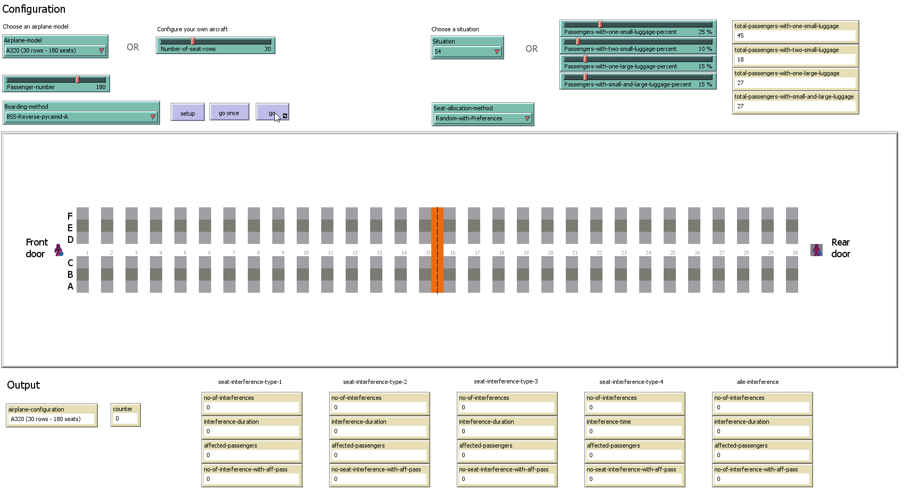

Please feel free to contact us at liviu.cotfas at ase .ro for the `NetLogo` source code.

# Boarding Methods

> All the simulations below have been performed using the luggage situation S4, described in our paper.

## Scenario 1
Occupancy level: 80% (144 passengers)
Seat assignment: random
Method: BS5-Reverse-pyramid-A

## Scenario 2
Occupancy level: 80% (144 passengers)
Seat assignment: random with preferences
Method: BS5-Reverse-pyramid-A

## Scenario 3
Occupancy level: 100% (180 passengers)
Seat assignment: random
Method: BS5-Reverse-pyramid-A

